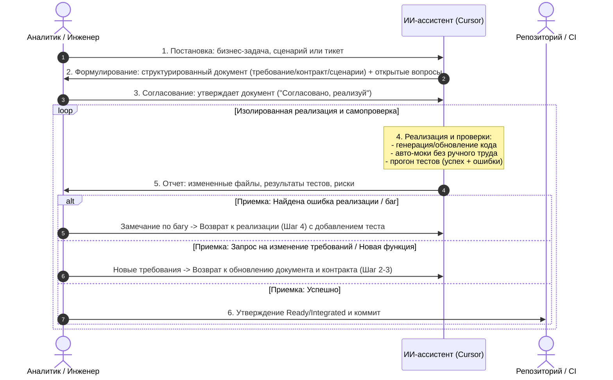

# Общее ядро Cursor Component Factory (fast-workflow)

Обязательные правила и ментальный каркас фабрики разработки и интеграции программных компонентов с участием аналитика (инженера) и ИИ-ассистента в Cursor.

Режимные регламенты:
- [COMPONENT_REPO_WORKFLOW.md](COMPONENT_REPO_WORKFLOW.md) — автономная разработка компонента/модуля (`Prototype → Ready`);
- [INTEGRATION_REPO_WORKFLOW.md](INTEGRATION_REPO_WORKFLOW.md) — интеграция опубликованных версий и проверка связей (`Integrated`).

Пошаговые команды и примеры: [USER_GUIDE.md](USER_GUIDE.md).

---

## 1. Главный принцип и архитектурные границы

> **Одна задача изменяет один компонент (модуль) или одну интеграционную связь в пределах строго заданных путей.**

Перед любым изменением кода должны быть определены:
1. Наблюдаемая цель и тип задачи.
2. Источник истины: пользовательское требование (`product/features/`), карточка компонента (`COMPONENT.md`) и схема контракта (`contracts/`).
3. Разрешённые и запрещённые пути (файловые границы).
4. Обязательные проверки (позитивный сценарий + негативный отказ) и условие остановки.

При возникновении смысловых противоречий или нехватки контекста ИИ **не додумывает бизнес-логику**, а останавливается и задает точные вопросы человеку.

---

## 2. Сквозной цикл «Аналитик ↔ ИИ» (Human-AI Loop)

Взаимодействие строится вокруг быстрого и прозрачного 5-шагового цикла:



### Шаги цикла:
1. **Шаг 1. Постановка (Аналитик):** Формулирование бизнес-потребности, пользовательского сценария или тикета простыми словами.
2. **Шаг 2. Документирование и открытые вопросы (ИИ):** Перевод постановки в структурированный документ (`product/features/<task>.md`), актуализация карточки (`COMPONENT.md`) и схемы контракта (`contracts/`). Все неоднозначности фиксируются в блоке «Открытые вопросы». ИИ не придумывает логику сам.
3. **Шаг 3. Согласование (Аналитик):** Человек проверяет документ, отвечает на вопросы и даёт команду на старт (*«Согласовано, реализуй»*).
4. **Шаг 4. Изолированная реализация и самопроверка (ИИ):** ИИ работает строго в рамках утвержденного документа: генерирует/обновляет код, автоматически поднимает моки по схеме контракта, пишет и прогоняет тесты (успех + отказ) и готовит технический отчет.
5. **Шаг 5. Приемка и фиксация (Аналитик):** Аналитик валидирует отчет, дает согласие на присвоение статуса (`Ready` / `Integrated`) и выполнение коммита.

### Обработка замечаний и циклы обратной связи (Feedback Loops)
- **Ветка А (Баг / Ошибка реализации):** Требования не менялись, но код работает не по спецификации или упал тест.
  * *Действие:* Аналитик указывает на ошибку → ИИ сразу возвращается на **Шаг 4** (добавляет воспроизводящий тест, исправляет код, повторно запускает тесты и обновляет отчет). Документы требований менять не нужно.
- **Ветка Б (Смысловое изменение / Новая функция / Scope Change):** Аналитик решил изменить поведение, добавить поле, кнопку или эндпоинт.
  * *Действие:* ИИ **запрещено** сразу писать код. Происходит возврат на **Шаг 2 (Документирование)**: ИИ обновляет документ требования и схему контракта с учетом правил SemVer (Minor/Major), аналитик согласовывает их на **Шаге 3**, и только затем начинается реализация (**Шаг 4**).
- **Ветка В (Внешний блокер):** Для фичи требуется изменение стороннего сервиса/модуля.
  * *Действие:* ИИ останавливается и формирует отдельную задачу в репозиторий-владелец.

---

## 3. Стандартизация машиночитаемых контрактов

Контракты описывают только внешние границы и правила взаимодействия. Контракт утверждается человеком и хранится в машиночитаемом формате.

### Матрица выбора формата контракта

| Тип границы / Стек | Рекомендуемый стандарт | Назначение и инструменты |
|---|---|---|
| **HTTP / REST / Webhooks** | `OpenAPI 3.1` (YAML/JSON) / `JSON Schema` | Автогенерация мок-серверов (Prism, MSW, WireMock), валидация рантайма, генерация DTO/клиентов. |
| **RPC / Backend-to-Backend** | `Protocol Buffers v3` (`.proto`) | Строгая бинарная сериализация, gRPC streaming, компиляция контрактов в код. |
| **Очереди и события (Kafka, RabbitMQ, NATS)** | `AsyncAPI` (JSON Schema / Avro / Protobuf) | Спецификация событий, топиков, каналов и payload сообщений. |
| **In-Process модули (TypeScript)** | `Zod` / `TypeBox` | Единый источник истины: одновременный вывод типов (`z.infer<T>`) и рантайм-валидация. |
| **In-Process модули (Python)** | `Pydantic v2` (`BaseModel`) | Строгая типизация, валидация входящих структур, автогенерация JSON Schema. |
| **In-Process модули (Go / Rust)** | Структуры со схемами валидации | `validator` в Go, `serde` + `schemars` в Rust. |
| **1С:Предприятие (HTTP-сервисы)** | `OpenAPI 3.1` | Описание REST HTTP-сервисов 1С, парсинг/сериализация BSL. |
| **1С:Предприятие (Шина / Очереди)** | `AsyncAPI` / `JSON Schema` | Обмен через шину (EnterpriseData, КД 3.0, JSON). |
| **1С:Предприятие (SOAP / XDTO)** | `XSD` / `WSDL` | Пакеты XDTO конфигурации. |
| **1С:Предприятие (Экспортные модули)** | `BSL TypeDoc` / `JSON Schema` | Сигнатуры методов общих модулей с аннотациями типов. |
| **Раннее прототипирование** | `JSON Schema (2020-12)` / `OpenAPI Draft` | Черновое согласование полей до выбора стека реализации. |

### Структура каталога контрактов
```text
contracts/
├── api/       # OpenAPI 3.1 спецификации (HTTP/REST эндпоинты)
├── events/    # AsyncAPI / JSON Schema (события и сообщения брокеров)
└── domain/    # Zod / Pydantic / Proto / XSD схемы моделей данных
```

---

## 4. Карточка компонента (`COMPONENT.md`)

Каждый компонент имеет единый паспорт ответственности:

```markdown
# Название компонента

## Назначение
Одна конкретная ответственность компонента.

## Специфика окружения (при наличии, например для 1С)
- Версия платформы: 8.3.24+
- Режим совместимости: 8.3.21
- Целевая конфигурация: 1С:ERP 2.5 / УТ 11
- Безопасный режим: Ложь (требуется доступ к HTTP)

## Входы
- Обязательные входные данные и параметры.

## Выходы
- Результаты работы и ожидаемые ошибки.

## Ответственность
- Реализуемые бизнес-правила.

## Не отвечает за
- Задачи и решения соседних компонентов.

## Зависимости
- Реальные зависимости и автоматические заглушки (mocks).

## Связанные контракты
- Пути к контрактам в contracts/ (с указанием версии).

## Версия
<семантическая версия, например 1.2.0, или «не назначена» для Prototype>

## Статус
Prototype | Ready

## Проверенная ревизия
- Git tag (например, component-name-v1.2.0).
- «Не назначена» для Prototype.

## Открытые вопросы
- Неопределенности, требующие решения человека.
```

- `Prototype` — границы и контракт уточняются, компонент в разработке.
- `Ready` — версия компонента и ее ревизия проверены изолированно и готовы к интеграции.
- `Integrated` — фиксируется **только в интеграционном контуре** для конкретной проверенной пары компонентов и контракта.

---

## 5. Стандарт обязательного README.md проекта

Каждый репозиторий фабрики (компонентный и интеграционный) обязан содержать в корне актуальный файл `README.md`, служащий единой точкой входа для разработчиков и инженеров.

### Обязательная структура `README.md`:
1. **Заголовок и назначение:** Название, краткое описание бизнес-роли, используемый стек технологий.
2. **Текущий статус и версия:** Статус (`Prototype` / `Ready` / `Integrated`), SemVer-версия, проверенная ревизия (Git Tag).
3. **Что нового в последней версии (Changelog):** Краткий перечень изменений, исправлений и новых возможностей в текущем релизе.
4. **Инструкция по развертыванию и запуску:** Пошаговое руководство по запуску во всех поддерживаемых режимах (автономный режим с Zero-Manual Mocks, рабочий/live режим, переменные окружения, порты, эндпоинты/Swagger).
5. **Инструкция по тестированию:** Команды для запуска всех уровней тестов (модульные, контрактные, компонентные, сквозные E2E тесты).

ИИ обязан синхронно обновлять `README.md` при каждом изменении версий, функциональности или параметров запуска.

---

## 6. Политика версионирования SemVer и Breaking Changes

Эволюция компонентов и контрактов подчиняется правилам Semantic Versioning (`MAJOR.MINOR.PATCH`):

1. **PATCH (`1.0.0 → 1.0.1`):** Внутренние исправления багов, оптимизация.
   * Контракт **не изменяется**.
   * Риск для потребителей: нулевой.
2. **MINOR (`1.0.0 → 1.1.0`):** Обратно-совместимое расширение функциональности.
   * Добавление опциональных полей в запрос, новых необязательных полей в ответ, новых эндпоинтов.
   * Версия схемы контракта обновляется на Minor. Старые потребители продолжают работать без изменений.
3. **MAJOR (`1.0.0 → 2.0.0`):** Ломающее изменение (Breaking Change).
   * Удаление или переименование обязательных полей, смена типов, изменение логики кодов ошибок.
   * **Правило безопасности:** ИИ обязан остановиться, предупредить о несовместимости и создать **новый файл контракта** (например, `contracts/api/service-v2.yaml`).
   * Интеграционные контуры обновляются на Major-версию только по отдельной задаче на миграцию.

---

## 7. Модель организации репозиториев (Polyrepo)

Workflow ориентирован на модель независимых полирепозиториев:

- Каждый компонент и каждый интеграционный контур находится в отдельном Git-репозитории.
- Граница ИИ: корень текущего открытого репозитория. Доступ к другим `.git` запрещен.
- Источник истины для версии: Git Tag (например, `auth-service-v1.2.0`).
- Для сквозного тестирования и совместной работы нескольких репозиториев используется функциональность Cursor Multi-Root Workspace (`File -> Add Folder to Workspace...`).

---

## 8. Обязанности и запреты ИИ

### ИИ обязан:
1. Читать источники истины (`product/features/`, `COMPONENT.md`, `contracts/`, `README.md`) перед любым редактированием кода.
2. Работать строго в разрешенных путях текущего компонента.
3. Сохранять минимальный дифф и не модифицировать несвязанные файлы.
4. Автоматически генерировать моки по контрактам (Zero-Manual Mocks).
5. Запускать обязательные проверки (минимум: 1 позитивный сценарий + 1 сценарий ожидаемого отказа).
6. Поддерживать и синхронно обновлять `README.md` (статус, чейнджлог последней версии, инструкции запуска и тестов).
7. Предоставлять структурированный отчет после работы.

### ИИ категорически запрещено:
1. Придумывать бизнес-правила или скрывать смысловую неоднозначность.
2. Самовольно менять утвержденные контракты.
3. Ослаблять тесты или удалять проверки ради получения «зеленого» статуса.
4. Одновременно изменять несколько компонентов или обе стороны интеграции (`consumer` + `provider`).
5. Присваивать статусы `Ready` или `Integrated` без прямого подтверждения человеком.

---

## 9. Решения, которые принимает только человек

Человек (Аналитик / Инженер / Архитектор) лично утверждает:
- Назначение, границы и бизнес-правила компонента.
- Схему контракта и внесение изменений в нее.
- Закрытие открытых вопросов.
- Присвоение статуса `Ready` для версии компонента.
- Присвоение статуса `Integrated` для связи в интеграционном контуре.
- Создание релизного коммита и Git Tag.

---

## 10. Формат обязательного отчета ИИ

После выполнения реализации ИИ предоставляет отчет:
1. **Измененные файлы:** список путей в рамках разрешенной области.
2. **Использованные контракты и версии:** перечень спецификаций.
3. **Результаты проверок:** команды запуска и вывод тестов (успешный путь + ожидаемый отказ).
4. **Сделанные предположения:** технические детали реализации.
5. **Оставшиеся риски и открытые вопросы:** что требует внимания аналитика.
6. **Следующий шаг:** готовность к приемке и фиксации.
